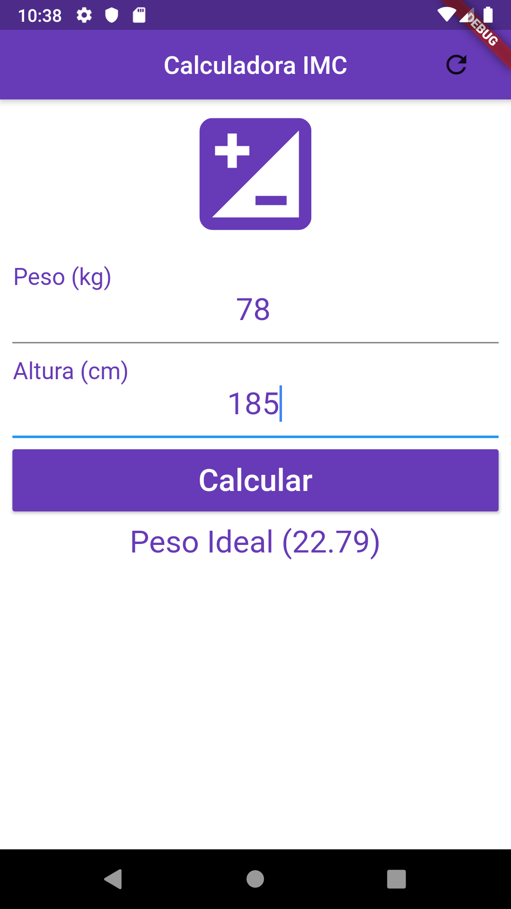

# Calculadora IMC - Flutter

Projeto 2 do curso [Criação de Apps Android e iOS com Flutter](https://www.udemy.com/curso-completo-flutter-app-android-ios/)

Calculadora que recebe como entrada Peso e Altura e informa como o valor do IMC e a condição da pessoa.

# Revisão - 2021
- Ajustando código para Flutter 2.0

---

